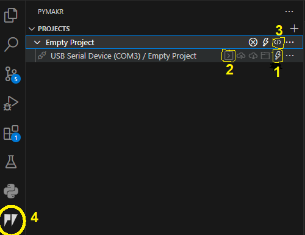

# IoT_project
1DT305 - Introduction to Applied IoT summer 2023
# __Weather information and best cloths for the occasion__
__Author: Patricia Antunes Marklund (pa222zn)__

1DT305 - Introduction to Applied IoT summer 2023

This project uses a temperature and humidy sensor to get input of the environment and calculate the weather report that will be displayed in a local LCD screen and online in the adafruit visualization platform.

- Approximately amount of time it might take to do this project

    This project should take around 4 hours to set up.

## __Objective__
I created this project with the aim of leveraging technology to improve my daily life. One particular area where I needed assistance was in determining the appropriate clothing for my daughter before she goes to school in the morning. To address this need, I developed a device that provides me with the weather report either through email or by displaying it on an LCD screen. This way, I can quickly make decisions about what clothes my daughter should wear, ultimately helping us avoid being late for school.

By creating this project, I have gained valuable insights into the implementation of an IoT (Internet of Things) system. I have learned about how data can be utilized and have explored some sensor implementations.

## __Material__
Follow all the material that is needed to make this project work.

| Sensor |  Picture |Price | Where I bought | Specification |
|----------|---------- |----------|----------|----------|
|   Rasberry pico W (with USB cable) |   |   SEK 143   |   [Amazon](https://www.amazon.se/Raspberry-Pi-SC0918-Pico-W/dp/B0B5H17CMK/ref=asc_df_B0B5H17CMK/?tag=shpngadsglede-21&linkCode=df0&hvadid=599545424288&hvpos=&hvnetw=g&hvrand=16551290283763217246&hvpone=&hvptwo=&hvqmt=&hvdev=c&hvdvcmdl=&hvlocint=&hvlocphy=1012511&hvtargid=pla-1925044604599&psc=1)   | Uses RP2040 microcontroller chip. Built-in Wi-Fi. 
|   LCD1602 Display |   |   * SEK 579   |   [Amazon](https://www.amazon.se/-/en/Compatible-Electronics-Supervision-Controller-Accessories/dp/B01IHCCKKK/ref=sr_1_1?crid=2KV92SEQE574M&keywords=elegoo+starter+kit&qid=1687768370&sprefix=ellego+sta%2Caps%2C101&sr=8-1)   | Text display 16×2 characters
|   I2C Interface for LCD |   |   SEK 39   |   [Elektrokit](https://www.electrokit.com/produkt/i2c-interface-for-lcd/)   | Works with all displays with HD44780 controllers and all microcontrollers that support I2C
|   DHT 11 sensor |  |   * SEK 579   |   [Amazon](https://www.amazon.se/-/en/Compatible-Electronics-Supervision-Controller-Accessories/dp/B01IHCCKKK/ref=sr_1_1?crid=2KV92SEQE574M&keywords=elegoo+starter+kit&qid=1687768370&sprefix=ellego+sta%2Caps%2C101&sr=8-1)   | 3.3V to 5V. Measures temperature and humidity
|   Breadboard |  |   * SEK 579   |   [Amazon](https://www.amazon.se/-/en/Compatible-Electronics-Supervision-Controller-Accessories/dp/B01IHCCKKK/ref=sr_1_1?crid=2KV92SEQE574M&keywords=elegoo+starter+kit&qid=1687768370&sprefix=ellego+sta%2Caps%2C101&sr=8-1)   | Full-size breadboard, 830 tie points.  It's 2.2" x 7" (5.5 cm x 17 cm) with a standard double-strip in the middle and two power rails on both sides
|   Wires |   |   * SEK 579   |   [Amazon](https://www.amazon.se/-/en/Compatible-Electronics-Supervision-Controller-Accessories/dp/B01IHCCKKK/ref=sr_1_1?crid=2KV92SEQE574M&keywords=elegoo+starter+kit&qid=1687768370&sprefix=ellego+sta%2Caps%2C101&sr=8-1)   | Various colors and set up (female - female / male - male)
|   10K Potentiometer |  |   * SEK 579   |  [Amazon](https://www.amazon.se/-/en/Compatible-Electronics-Supervision-Controller-Accessories/dp/B01IHCCKKK/ref=sr_1_1?crid=2KV92SEQE574M&keywords=elegoo+starter+kit&qid=1687768370&sprefix=ellego+sta%2Caps%2C101&sr=8-1)   |  Total resistance of 10.000 ohms (10KΩ)


\* Price for the full start kit. This component is part of the kit
- __Raspberry pico W (with USB cable)__

The Raspberry pico W is a microcontroller board with built-in Wi-Fi which is utilized in this IoT project as the brain. It receives input from the temperature and humidity sensor (DHT11) and sends this input information via Wi-Fi, using MQTT protocol to the internet. The result defined by the input will generate an output which will be a message to be displayed at the LCD1602. 
The USB cable is used to upload the code. Also being used as a power source. 

- __LCD1602 Display__

The LCD is used in this project to display the message received by the output of the microcontroller Raspberry pico W. According to the temperature and humidity the messages displayed can be:
> - Temp. Too cold! Overalls
> - Temp. Snow day. Put everything
> - Temp. Bit chill. Jacket
> - Temp. Rainy day! Rain cloths
> - Temp. Nice weather. Light jacket
> - Temp. Warm weather. T-shirt & hat
> - Temp. Too Hot! Shorts & flops!

- __I2C Interface for LCD__

This I2C interface is used to easily connect the LCD to the Raspberry pico W board.

- __DHT 11 Temperature and humidy sensor__

This sensor is used to read the temperature and humidity of the environment. It is connected to the input of the raspberry pico W board.

- __Breadboard__

The breadboard is used to easily connect all components. It makes the connections more stable and easy access. It connects all ground and power to one point, which removes the need for extra jump wires.

- __Wires__

Jumper wires are used to connect each leg of the component from one point to another. It helps the layout of the connections and provide an easy way to find what is connected by using its different colors. In my project red is always source.

- __Potentiometer__

The 10K potentiometer is used together with the LCD display for controlling the contrast or brightness of the display.

## __Computer setup__

The project is programmed using Micropython as programming language. 
The IDE used in this project is Visual Studio Code, which is a great tool as interface to program and connect with the microcontroller raspberry pico W.

- __Step 1__: Flashing the microcontroller with the latest firmware. Which can be found [here](https://rpf.io/pico-w-firmware)

    Plug in the USB cable to the board connector and hold down the BOOTSEL button located on the board. Hold the button down while pluggin the other USB end to the computer. When the file manager opens in the computer, drag and drop the firmware file downloaded from the link above to the raspberry microcontroller folder.

- __Step 2__: Download and install Node.js. Which can be found [here](https://nodejs.org/en)

- __Step 3__: Download Visual Studio Code IDE [here](https://code.visualstudio.com/Download)

- __Step 4__: Add Pymakr plugin to the VS code IDE

    Go to view >> extensions and search for Pymakr. Click on install and wait until it shows installed

- __Step 5__: Create project

    A new icon will show up on the left tab of VS code IDE. Click on the Pymakr icon and click on create a new project. Give a name to the project and select empty.

- __Step 6__: Add the raspberry board to the project and connect

     
    
    CLick on add devices and select the board that shows connected. On the pymakr window __(4)__ press the little light button __(1)__ to connect. Click on the terminal button __(2)__ to open the terminal. Run the code in development mode so it saves automatically to the board, by pressing the button __(3)__

You are now all set to create and run the code. 

## __Putting everything together__

In this session I will show how to connect the components for the project. In the figure below you can see the exactly connections with the wiring diagram.


The website used to make the drawing didn't have available the DHT11 sensor, therefore the DHT11 on the circuit has 4 legs, but it should be 3. Also it was not available the interface I2C separated from the display. But the following layout shows exactly how to connect using the interface with the LCD used in this tutorial

    

[link to source of the drawing](https://www.circuitschools.com/interfacing-16x2-lcd-module-with-raspberry-pi-pico-with-and-without-i2c/#google_vignette)

The microcontroller raspeberry pico W has 40 pins in the board, but when programming the pins have a different number. Because not all of them are I/O's.


The signal pin 2 in the DHT11 (temperature and humidity sensor) is connected to the pin 34 in the board, and on the pin 28 when programming. The supply pin 1 in the DHT11 is connected to the 3V pin 36 on the board. The GND pin 3 on the DHT11 is connected to the GND pint 38 on the board. Note that the 3V red wire and the GND black wire from the board are going to a common rail in the bottom, so other components can share the same pinnage. 

 
The pin 1 from the 10K potentiometer is connected to the 5v pin 40 from the board. The pin 2 from the potentiometer is connected to the pin 3 from the LCD (the regular pins from the LCD). The pin 3 from the potentiometer is connected to the GND. Note the 5v (pin 40) and the ground are connected to the top rail, so other components can share the same pins.

In the I2C interface with the LCDThe, pin VCC pin from the I2C is connected to the 5V in the top rail. The GND pin from the I2C is conneted to the GND in the top rail. The SCL pin fomr the I2C is connected to the pin 12 on the board (pin 9 programming), and the pin SDA on the I2C is connected to the pin 11 on the board (pin 8 programming).

The potentiometers is needed on this circuit to control the brightness of the LCD. In fact without it was not possible to display the message on the LCD.

## __Platform__

For this project I decided to use the [Adafruit](https://www.adafruit.com/) platform. This platform provide cloud-based services for visualizing real-time data. It is possible to send data from the raspberry board to the cloud and store in the feed and then create a dashboard to visualize the data. There is though a restriction with the amount of widgets that can be added to the dashboard in the free subscription.

The choice for this platform was made because it is beginners friendly to set up and it is free. For a future where I scale the project I will probably have to change for a payed platform that offers more widgets and visualization options.

## __The code__

For programming this project I am using Micropython for the language. We have in the code the following modules: *dht.py* (library for the temperature sensor), *lcd_api.py* (library for the LCD1602), *mqtt.py* (configuration for mqtt protocol), *pico_i2c_lcd.py* (configuration for I2C), *secrets.py* (wifi user id and password), *wifi.py* (wifi connection) and *main.py* (all code runs here).

In the first part of the code in the *main.py* there is the importing session. Where we import the main libraries to run the code (such as time, machine). As well as the libraries to run the harware components (such as the DHT11).

```
import time
from mqtt import MQTTClient   
import ubinascii              
import machine                
import micropython            
from machine import Pin      
import utime as time
from dht import DHT11
import wifi
from machine import I2C, Pin
from pico_i2c_lcd import I2cLcd
```
Following we have the settigns. Where we set up the variables for the MQTT pub/sub messages, also the initialization of the I2C and LCD.

```
# BEGIN SETTINGS
i2c = I2C(0, sda=Pin(8), scl=Pin(9), freq=400000)
minutes = 5
INTERVAL = minutes * 60     # 300 seconds = 5 minutes
led = Pin("LED", Pin.OUT)   # led pin initialization for Raspberry Pi Pico W

# Adafruit IO (AIO) configuration
AIO_SERVER = "io.adafruit.com"
AIO_PORT = 1883
AIO_USER = "user_name"
AIO_KEY = "key_name"
AIO_CLIENT_ID = ubinascii.hexlify(machine.unique_id()) 
AIO_LIGHTS_FEED = "Paty_Marklund/feeds/lights"
AIO_TEMP_FEED = "Paty_Marklund/feeds/temperature"
AIO_HUMID_FEED = "Paty_Marklund/feeds/humidity"
AIO_MESSAGE_FEED = "Paty_Marklund/feeds/message"
AIO_HELLO_FEED = "Paty_Marklund/feeds/hello"
```

In this session of the code we check the input of the sensor and provide the message for the weather report. I return the messages that will be displayed on the LCD and sent to adafruit.

```
def weather_report(temp, humidity):
    temperature = int(temp)
    message_1 = " "
    message_2 = " "
    if temperature > 30 and humidity < 70:
        message_1 = str(temperature)+"C Too hot!"
        message_2 = "Shorts & flops!"
    elif temperature > 25 and humidity < 70:
        message_1 = str(temperature)+"C Warm weather"
        message_2 = "T-shirt & hat"
    elif temperature > 20 and humidity < 70:
        message_1 = str(temperature)+"C Nice weather"
        message_2 = "Light jacket"
    elif temperature > 10 and humidity < 70:
        message_1 = str(temperature)+"C Bit chill"
        message_2 = "Jacket"
    elif temperature > 0 and humidity > 70:
        message_1 = str(temperature)+"C Rainy day"
        message_2 = "Rain cloths"
    elif temperature > 0 and humidity < 70:
        message_1 = str(temperature)+"C Too cold"
        message_2 = "Overalls"
    elif temperature < 0 and humidity > 70:
        message_1 = str(temperature)+"C Snow day"
        message_2 = "Put everything"
    else:
        message_1 = str(temperature)+"C Too cold"
        message_2 = "Overalls"
        
    return message_1, message_2
```
The next funtion in the code is to display the message on the LCD. The messages are received in the parameter and printed in the first and second line of the display

```
def display_message(message_1, message_2):
    I2C_ADDR = i2c.scan()[0]
    lcd = I2cLcd(i2c, I2C_ADDR, 2, 16)
    print()
    lcd.move_to(0,0)
    lcd.putstr(message_1+"\n")
    lcd.move_to(0,1)
    lcd.putstr(message_2)
```
In this next part of the code is where we read the temperature and humidity and publish them. We also publish the messages generated by the weather report funcion and and subscribe for messages we can receive from the adafruit platform directly to the LCD.
Note the if statement which restricts the function calling to generate the weather report and update the LCD to only when it is the first time the circuit is started or whenever the temperature and the humidity changes. Otherwise the same message will be displayed in the LCD. This decision was taken so the LCD is not constantly flickering every time a new message arrives. 

```
while True:
        try:
            temp = sensor.temperature
            time.sleep(2)
            humid = sensor.humidity
        except:
            print("An exception occurred")  
            continue  
        
        if (prev_humid is None or prev_temp is None) or (temp != prev_temp and humid != prev_humid):
            prev_temp = temp
            prev_humid = humid
            message_1, message_2 = weather_report(temp, humid)
            publish_message = message_1 + " / " + message_2
            display_message(message_1, message_2)
            
        print("Publishing: {0} to {1} ... ".format(temp, AIO_TEMP_FEED), end='')
        print("Publishing: {0} to {1} ... ".format(humid, AIO_HUMID_FEED), end='')
        print("Publishing: {0} to {1} ... ".format(publish_message, AIO_MESSAGE_FEED), end='')
        
        pub_sub(temp, humid, publish_message)   # Call method to publish and subscribe
    
# Method to publish and subscribe to messages
def pub_sub(temp, humid, publish_message):
    try:
        client.publish(topic=AIO_TEMP_FEED, msg=str(temp))
        client.publish(topic=AIO_HUMID_FEED, msg=str(humid))
        client.publish(topic=AIO_MESSAGE_FEED, msg=str(publish_message))
        client.subscribe(AIO_HELLO_FEED)
        print("DONE")
    except Exception as e:
        print("FAILED")
    finally:
        time.sleep(INTERVAL) 
```
Apart from that there is a part of the code where the module to connect to the internet is called and the part where the MQTT communication is initialized.

## __Transmitting the data / connectivity__

The data is transmitted to the internet using WIFI and MQTT protocol directly to the Adadruit visulization platform. 

The MQTT protocol publish and subscribe a message to a topic that is received/sent to the Adafruit platform. An example of a topic: "Paty_Marklund/feeds/lights". Where the first segment Paty_Marklund is the Adafruit client name, the second segment feed is the category of the data set up on Adafruit. The third segment lights is the specific data feed under the feed category. 

The data is sent every 5 min. Which was a choice made so there is enough time to make a proper reading of the sensor input.

MQTT was chosen for this project because it is ligth weith and fast transmition. WIFI has a large bandwidth and low range. But considering the circuit is intalled in my own house there is no need to use another wireless protocol with larger range. This way I can maintain fast communication for the scale of my project. 

## Presenting the data
Describe the presentation part. How is the dashboard built? How long is the data preserved in the database?

- Provide visual examples on how the dashboard looks. Pictures needed.
- How often is data saved in the database.
- *Explain your choice of database.
- *Automation/triggers of the data.

## Finalizing the design
Show the final results of your project. Give your final thoughts on how you think the project went. What could have been done in an other way, or even better? Pictures are nice!

I think the project went pretty good in overall. I learned a lot from building this circuit, connecting the board to the internet and send data to the Adafruit platform

<!--  -->

Follow a video presentation of the main functionalities of the project.

<!-- <video width="640" height="360" controls>
 <source src="Pictures/presentation.mp4" type="video/mp4">
</video> -->
